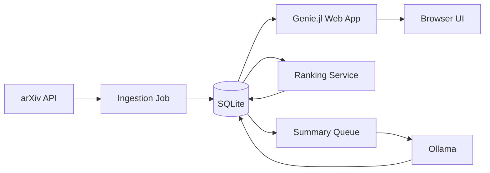

# Implementation Plan

## Product Goal

Build a local-first Julia application that helps an astrophysicist scan new arXiv papers, understand the field at a glance, and gradually personalize the ranking based on explicit feedback.

## Fixed Decisions

- Initial deployment target: local macOS app running in a browser.
- arXiv scope for v1: first-time submissions only, limited to the astro-ph family.
- Summary depth: abstract summaries for all papers, PDF summaries only for top-ranked unseen papers and papers marked `interested` or `very interested`.
- Personalization goal: personal interest ranking first; topic maps and richer author models can follow later.
- AI mode: local-first through Ollama, with a provider interface that can support cloud models later.
- Zotero integration is explicitly out of scope for Phase 1.

## External Constraints

### arXiv

- The arXiv API returns Atom feeds.
- Entry `<published>` is the first submission date and `<updated>` is the retrieved version date.
- Version-1 submissions satisfy `published == updated`, which gives a reliable first-pass filter for first-time submissions.
- The API supports `submittedDate:[YYYYMMDDTTTT TO YYYYMMDDTTTT]` filters in GMT.
- arXiv asks clients to cache results and avoid unnecessary repeat polling. For multi-call harvests, leave a roughly 3 second delay between requests.

### Zotero

- The official Zotero Web API supports writes, but requires authenticated requests.
- That means true one-click sync needs a user library ID and API key.
- A zero-credential local mode can later support export of selected papers as BibTeX and CSL-JSON so they can be imported into Zotero manually.

## Recommended Architecture



## Main Components

### 1. Ingestion

The ingestion job runs once per day after the arXiv daily update window and can also be invoked manually.

Query all astro-ph categories explicitly rather than relying on wildcard behavior:

- `astro-ph.CO`
- `astro-ph.EP`
- `astro-ph.GA`
- `astro-ph.HE`
- `astro-ph.IM`
- `astro-ph.SR`

Recommended query shape:

```text
search_query=(cat:astro-ph.CO OR cat:astro-ph.EP OR cat:astro-ph.GA OR cat:astro-ph.HE OR cat:astro-ph.IM OR cat:astro-ph.SR) AND submittedDate:[YYYYMMDD0000 TO YYYYMMDD2359]
sortBy=submittedDate
sortOrder=descending
```

Ingestion rules:

1. Fetch the requested date window in pages.
2. Parse Atom entries and normalize IDs, authors, categories, comments, DOI, and PDF links.
3. Keep only first-time submissions where `published == updated`.
4. De-duplicate by canonical arXiv paper ID.
5. Persist the raw metadata and a normalized search document used by ranking and summaries.

### 2. Storage

Use SQLite for v1. It is reliable, simple to inspect, and more than adequate for a single-user local application.

Core tables:

- `papers`: arXiv ID, title, abstract, published_at, updated_at, primary_category, doi, pdf_url, abs_url, comment, journal_ref
- `paper_authors`: paper ID, author position, normalized author name, affiliation if present
- `paper_categories`: paper ID, category code, is_primary
- `paper_features`: paper ID, keyword tags, topic tags, embedding provider, embedding vector reference, feature JSON
- `abstract_summaries`: paper ID, model, prompt version, summary text, key points JSON, confidence metadata
- `pdf_summaries`: paper ID, model, extraction status, summary text, key points JSON, chunk metadata
- `user_labels`: paper ID, label value, created_at, source
- `paper_scores`: paper ID, score, score_components JSON, ranked_at
- `ingestion_runs`: started_at, finished_at, date_window, status, notes

For embeddings, start with vectors serialized into SQLite or sidecar files under a data directory. If this becomes awkward, move them into a simple local vector index in phase 2.

### 3. Ranking and Personalization

V1 should avoid heavyweight supervised training. A transparent adaptive scorer is enough and easier to trust.

Recommended score components:

- embedding similarity to your positive-interest profile
- penalty for similarity to explicitly uninteresting papers
- seed topic bonuses for high-energy astrophysics, compact objects, accretion, jets, transients, X-ray binaries, AGN, clusters, neutron stars, black holes, and strong-gravity language
- recency bonus within the selected time window
- optional mild author prior once repeated positive labels exist

Suggested v1 profile model:

1. Build one centroid from papers labeled `interested` and `very interested`, with higher weight on `very interested`.
2. Build a second centroid from `not interested` papers.
3. Score each candidate by positive cosine similarity minus negative cosine similarity.
4. Add heuristic topic bonuses and recency.
5. Store score explanations so the UI can show why a paper surfaced.

This gives useful adaptation immediately and can later be replaced by a learned classifier without changing the UI or storage model.

### 4. AI Summaries

Use AI where it pays off and avoid spending cycles where structured extraction is enough.

Recommended model roles:

- `qwen2.5:7b` for structured abstract and PDF summaries
- a small embedding model in Ollama, such as `nomic-embed-text`, for ranking features

Abstract workflow for every paper:

1. Clean the abstract text.
2. Ask the model for a short structured output containing:
   - one plain-language summary
   - three to five key points
   - topic tags
   - a coarse relevance guess for your science interests
3. Validate the JSON and store the result.

PDF workflow for selected papers only:

1. Download the PDF once it reaches the top-ranked unseen set or receives an explicit positive label.
2. Extract text via `pdftotext` invoked from Julia.
3. Chunk the text by section length.
4. Produce section summaries and then a merged paper-level summary.
5. Cache aggressively so reranking never recomputes old summaries.

Operational safeguards for a 16 GB Mac:

- run one generation at a time by default
- keep PDF summarization in a background queue
- cap PDF jobs per refresh cycle
- let the UI show summary status instead of blocking page load

### 5. Web UI

Use `Genie.jl` with server-rendered pages and light `HTMX` interactions rather than a large frontend framework.

Main views:

- `Today`: first-time astro-ph submissions from the latest arXiv day
- `This Week`: rolling 7-day view
- `This Month`: rolling 30-day view
- `Queue`: papers marked `very interested` or pending deeper summary

Paper card contents:

- title, authors, primary and secondary categories
- abstract summary and key points
- score and compact explanation
- links to arXiv abstract and PDF
- label buttons: `not interested`, `interested`, `very interested`

Overview panel contents:

- counts by day in the selected time window
- topic distribution across current results
- top-ranked unseen papers
- authors that recur in the current window

### 6. Zotero Integration

Zotero integration should be deferred until after the core reader, ranking, and PDF summary workflow is working well.

Support two later modes.

#### Mode A: No Credentials

- Export selected papers as BibTeX and CSL-JSON.
- Offer single-paper export and batch export for the current shortlist.
- This is the safest default for local-only usage.

#### Mode B: Direct Zotero Sync

- If the user provides a Zotero user ID and API key, create items through the official Zotero Web API.
- Create or target a dedicated collection such as `arxiv-viewer`.
- Include arXiv ID, abstract, authors, publication date, tags, and the arXiv URL.
- Mark sync state locally so repeated clicks do not create duplicates.

Recommendation: ship Mode A after the core reading workflow is stable and add Mode B after that.

## Suggested Julia Package Set

- `Genie.jl`
- `SQLite.jl`
- `DBInterface.jl`
- `HTTP.jl`
- `EzXML.jl`
- `JSON3.jl`
- `DataFrames.jl`
- `Dates`
- `LoggingExtras.jl`

Optional later:

- `SearchLight.jl` if you want ORM-style models, though direct SQL is fine for v1
- `TaskMaster.jl` or a simple local queue abstraction if background jobs grow more complex

## Delivery Plan

### Phase 1: Core Reader

- initialize Julia project and dependencies
- ingest first-time astro-ph submissions into SQLite
- build `Today`, `Week`, and `Month` pages
- support labeling and local persistence

Success condition: you can open the local page, browse the latest astro-ph papers, and persist your labels locally.

### Phase 2: Abstract Intelligence

- add abstract summaries for all papers
- add embeddings and adaptive ranking
- show score explanations and a `read next` queue

Success condition: newly ingested papers are automatically summarized and reprioritized based on your explicit labels.

### Phase 3: Selective PDF Intelligence

- add background PDF download and text extraction
- summarize only top unseen papers and explicitly interesting papers
- surface deeper summaries in the queue and detail views

Success condition: the app produces useful deeper summaries without trying to process every PDF.

### Phase 4: Zotero Export

- add BibTeX and CSL-JSON export for selected papers and batches
- track export history locally

Success condition: you can move shortlisted papers into Zotero manually without leaving the app workflow.

### Phase 5: Direct Zotero Sync and Polish

- add optional authenticated Zotero sync
- improve author priors and topic facets
- add saved filters, export history, and operational controls

## Risks and Mitigations

- arXiv rate etiquette: cache daily results and avoid aggressive polling.
- LLM instability: require structured JSON outputs and validate them before storage.
- Limited local memory: keep the model path narrow, serialize background jobs, and summarize selectively.
- Personalization cold start: begin with seed topic heuristics and only then shift toward label-driven ranking.
- Zotero friction: keep Zotero out of the initial implementation so the reading workflow is not blocked by API setup.

## Immediate Next Build Step

Start with Phase 1 and keep the first milestone deliberately narrow:

1. scaffold the Julia project with `Genie.jl` and `SQLite.jl`
2. implement arXiv ingestion for first-time astro-ph submissions
3. render the first `Today` page from local data
4. add the three feedback labels and persist them